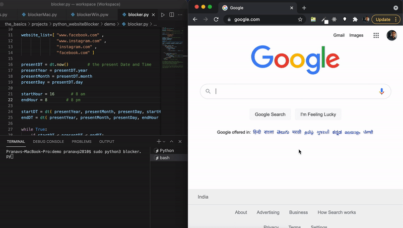

# python_websiteBlocker
Modifies hosts file, to include or omit the specified blocked sites, in the specified time window.
<br><br>

<br><br>
Loops every 5 second and checks if it should block sites or not by the time and modifies host file accordingly. 
<br><br>
## For Mac:
To automate this task and have it run at startup:<br><br>
go to Terminal and type in
```
sudo crontab -e
```
at the bottom of file type in 
`@reboot python3 <COMPLETE DIRECTORY LOCATION OF PYTHON SCRIPT>`
<br><br>
eg: `@reboot python3 /Desktop/scripts/blockerMac.py`<br><br>
exit by pressing cntrl and X keys together<br>
## For Windows:
To automate the task and have it run at starup:<br><br>
Go to Task Scheduler on Windows, <br><br>
Create a new task, name it, eg: `Website blocker`, then check `Run with highest previleges`, <br><br>
go to `Triggers` tab in same task window and say Begin the task: `At Startup` <br><br>
go to `Actions` tab in same task window, click `New..`, <br><br>
select from dropdown `Start a program`, and click Browse to locate the pyw file `blockerWin.pyw` <br><br>
go to `Conditions` tab and uncheck `Start the task only if computer is on AC power`<br><br>
note: pyw files can execute by click without manually running on cmd on windows which allows for this automation


